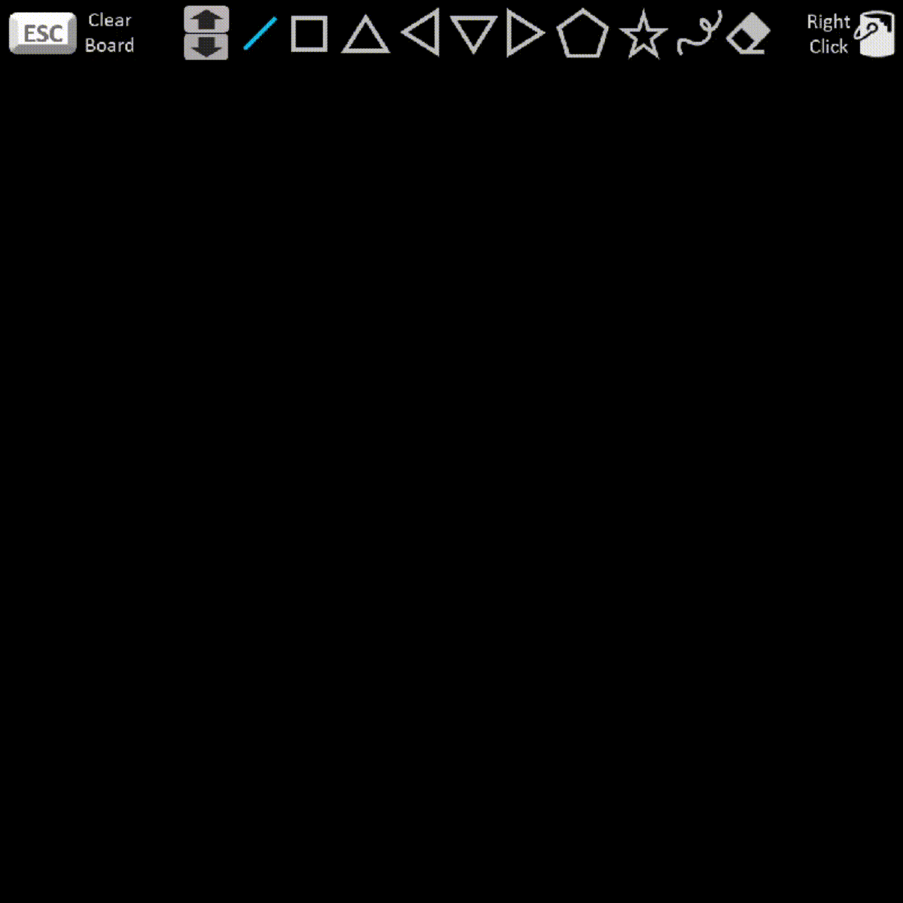
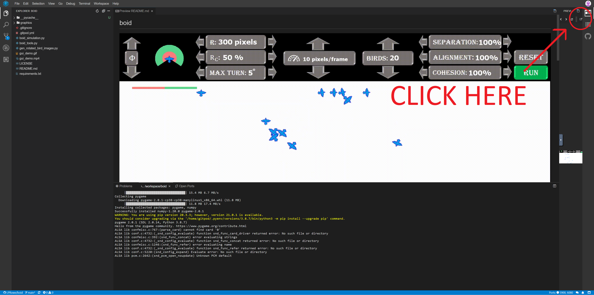

## union-find-drawing-game
Draw shapes and fill them in, when shapes overlap or touch they merge together and the smaller shape changes to the color of the larger shape.

## Try it yourself.

Method 1: Click the Gitpod button below - wait a minute - pop the window out by clicking the expand button circled in the image below.

Method 2: Clone this repo and run union_find_drawing_demo.py in python3, dependencies are listed in requirements.txt

## Controls

<b>Left Click, Drag, Release:</b> Draw the shape indicated on the banner. 
<b>Up Arrow:</b> Move to the next drawing tool. 
<b>Down Arrow:</b> Move to the previous drawing tool 
<b>Escape Key:</b> Erase the entire board. 
<b>Right Click:</b> Paint fill the current region. 
<b>Eraser tool:</b> Left click to erase a network of shapes. 

## About

This project is meant to act as a visual aid for the behavior of the union find data structure.  

Each shape is composed of several pixels and each pixel can be thought of as a node.  

Nodes that are 4-directionally adjacent (up, down, left, or right) share an edge.  

We say that two nodes are connected if there is a series of edges that goes from one node to the other node.    

All of the nodes in a shape are connected, so they are given the same color to indicate that they belong to the same group.  

<i>Note: There are only 13 color options. Sometimes 2 different groups will have the same color.</i>  

When 2 originally separate different groups of nodes become connected by the addition of a new set of nodes, then they belong to the same group.  

This is done by merging the smaller group into the larger group.  Visually you will see the smaller group turn into the color of the larger group.  This can be observed in the GIF located above.    